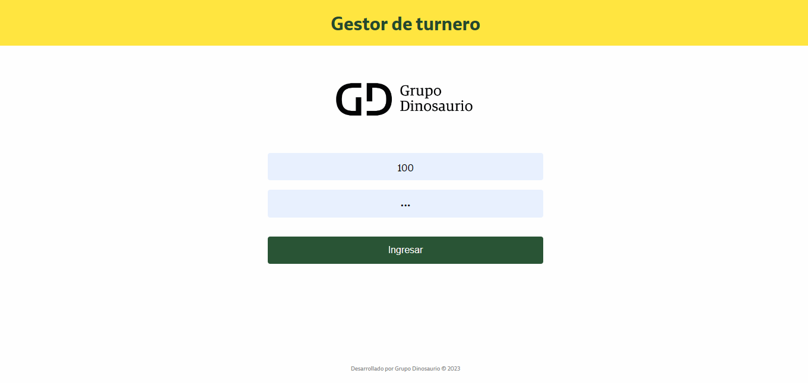
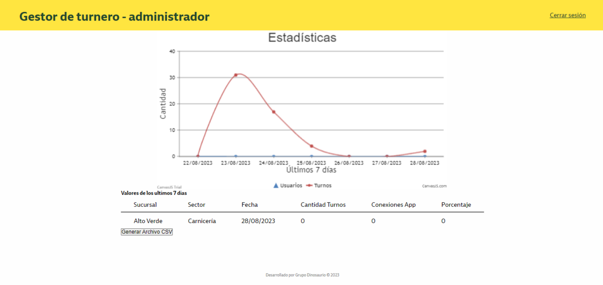
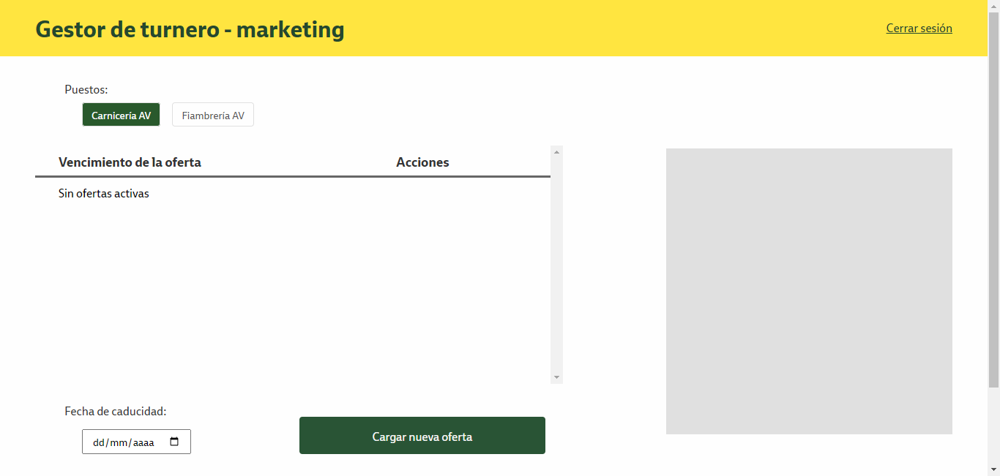

<header align="center">
  
  <h1 align="center">Gestor del turnero digital</h1>
  
  
Visualizá reportes, cambiá las ofertas de un puesto y logeate como puesto

 
</header>

<section align="center">

[Documentación](https://github.com/grupodinosaurio/FrontEndTurneroDino)
·
[Ver gestor del turnero](http://172.17.2.8:9090/miturno)
·
[Reportar Bug](https://github.com/grupodinosaurio/FrontEndTurneroDino/issues)
·
[Solicitar Feature](https://github.com/grupodinosaurio/FrontEndTurneroDino/issues)

</section>

<!-- TABLE OF CONTENTS -->

  
Indice de contenidos

  <ul>
    <li>
      <a href="#about-the-project">Sobre el Proyecto</a>
      <ul>
        <li><a href="#capturas">Capturas</a></li>
        <li><a href="#stack">Stack & Dependencias</a></li>
      </ul>
    </li>
    <li><a href="#install">Como iniciar</a></li>
    <li><a href="#contact">Contactos</a></li>
  </ul>

 
 

<section id="about-the-project">
  <h2>💼 Sobre el Proyecto</h2>

El gestor del turnero es una web que permite al usuario `visualizar reportes de uso` para cada puesto, `modificar las ofertas` de un puesto y logearte como uno para `empezar a usar el turnero`

El gestor cuenta con 3 tipos de usuario: `Marketing, administrador, puesto`

Para el usuario marketing permite:

- `Visualizar las ofertas actuales` de un puesto
- `Dar de baja` una oferta activa
- Subir un nueva oferta `con fecha de caducidad o válida por un día (por defecto)`

Para el usuario administrador permite:

- Visualizar un `reporte con la cantidad de turnos` de un puesto
- Visualizar un `reporte con la cantidad de usuarios` de un puesto
- `Descargar en formato CSV` todo tipo de reporte

_Esta web se complementa con un turnero digital que cada usuario comprador puesde acceder escaneando un código QR._

<article id="capturas">

  <h3>📸 Capturas</h3>

 

 

 

</article>
  
 
 
  
<article id="stack">
  
  <h3>👾 Stack & Dependencias</h3>

| **Nombre**                    | **Versión** |
| ----------------------------- | ----------- |
|                               |             |
| nodeJs                        | 18.16.0     |
| npm                           | 9.6.6       |
|                               |             |
| @angular-devkit/build-angular | 16.0.3      |
| @angular-devkit/core          | 16.0.3      |
| @angular-devkit/schematics    | 16.0.6      |
| @angular/cli                  | 16.0.6      |
| @schematics/angular           | 16.0.6      |
| rxjs                          | 7.8.1       |
| typescript                    | 5.0.4       |
|                               |             |
| canvasjs                      | lastest     |

</article>
  
 

</section>

<section id="install">
  <h2>💻 Como iniciar</h2>

<article>
  
  *Para el proyecto es necesario tener instalado NodeJs & npm*

  <pre>
  <code>
   $ git clone https://github.com/grupodinosaurio/FrontEndTurneroDino/ // Clone the repo
   
   $ git checkout main // rama main del front
   
   $ npm install // Instalación de dependencias
  </code>
  </pre>

   
  
  El proyecto está estructurado de la siguiente forma:  
  
  <pre>
    + src
        + app
            + core
                + components
                + modules
                + pages
            + shared
                + components
                + guards
                + interceptor
                + models
                + services
  </pre>
  
En la carpeta `core/pages` se vaun componente general que es exportado en cada módulo, el resto de componentes son llamados desde `core/components` o importados desde su módulo compartido que se encuentra en `shared`

En la carpeta `shared/models` se van a encontrar las interfaces, las cuales están modularizadas para las respuestas de servicios y/o variables.

En la carpeta `shared/services` se van a encontrar servicios con responsabilidades divididas para cada acción.

   
   
   

Cómandos para desarrollo local

  <pre>
  <code>
  // Para cambiar las variables de entorno ingresar a 'src/environments'

   $ ng serve --configuration production // desarrollo local con API de producción

   $ ng serve // desarrollo local con API de testing
  </code>
  </pre>

   
   
  
Para preparar el proyecto y subir a producción se deberá ejecutar el siguiente comando
  
  <pre>
  <code>
// 1. Eliminar todos los archivos, a excepción de .htaccess, de la ruta 
//    'C:\wamp64\www\miturno' del servidor 'GDALVSRVDM01'
// 2. Ejecutar el comando de abajo
// 3. Copiar el resultado en la carpeta 'dist/turnero'
// 4. Pegar en la ruta del servidor

$ npm run build --omit=dev
  </code>
  </pre>
  
</article>
  
</section>

 
 

<section id="contact">
  <h2>🤝🏽 Contactos</h2>

<article>
  
  Participantes del proyecto:
  
  - Hugo Ragno (Product Owner)
  - Marcelo Urriche (Scrum Master)
  - Marcos Castillo (Desarrollador)
  - Matias Molina (Desarrollador)
  - Cristian Sosa (Desarrollador)

</article>
  
</section>
